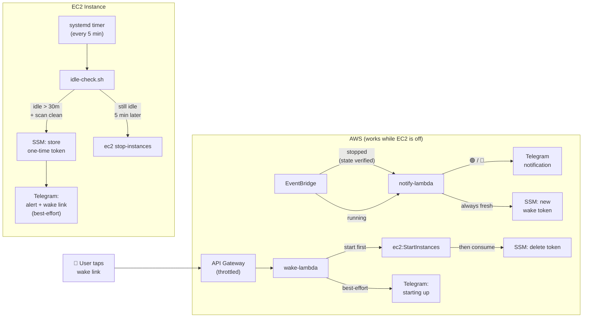

# BOOTSTRAP-IDLE-SHUTDOWN.md — Idle Shutdown & Wake for EC2 Agents

> **Purpose:** Automatically shut down the EC2 instance after 30 minutes of user inactivity. Sends a Telegram alert with a **one-tap wake link** before shutdown. EventBridge notifies you when the instance starts or stops, and auto-generates a fresh wake link on shutdown.



---

## How It Works

### Idle Detection (on-instance)

1. A **systemd timer** fires every 5 minutes
2. A bash script calls a Python helper that reads OpenClaw session JSONL files
3. Only messages with structured Telegram `sender_id` metadata (regex-matched) count as real user activity — heartbeat polls, system notifications, and memory flushes are excluded
4. All content parts are inspected (not just the first), and timestamps are compared as parsed `datetime` objects (not strings)
5. **Fail-closed safety:** If any session files are unreadable or timestamps can't be parsed, shutdown is blocked even if older data suggests idle. Scan errors are logged and retried next cycle.
6. If idle > 30 min AND scan is clean: generates a one-time UUID wake token → stores in SSM → sets shutdown state → sends Telegram alert (best-effort — failure doesn't block shutdown)
7. On the next run (5 min later), if still idle: shuts down via `aws ec2 stop-instances`
8. If recently booted (< 15 min): shutdown is skipped to prevent the wake → immediate re-shutdown race
9. **Bootstrap policy:** If no user messages are ever found and uptime > 1 hour, shuts down to prevent orphaned instances
10. **flock** prevents overlapping timer runs

### Wake Link (serverless, works while EC2 is off)

1. User taps wake link in Telegram → API Gateway (throttled: 1 req/sec, burst 5) → Wake Lambda
2. Lambda validates the one-time token from SSM (does NOT consume it yet)
3. Checks instance state — rejects if `running`, `stopping`, or `pending`; returns 503 if state check fails
4. **Starts instance first** (critical path), then deletes token, then sends Telegram notification (best-effort)
5. If start fails, token is preserved so the wake link stays valid
6. Instance ID is the only config required to wake — Telegram config is loaded separately and treated as optional
7. Returns a styled HTML status page for each outcome

### EventBridge Notifications (serverless)

1. **Instance starts** → retries up to 3× for public IP → Telegram 🟢 notification (with fallback message if IP isn't ready)
2. **Instance stops** → **verifies actual EC2 state** (guards against stale/out-of-order events) → generates fresh wake token → Telegram 🔴 notification with wake link
3. **Deduplication:** Stop events are deduped by EventBridge event ID via SSM marker to prevent duplicate token rotations
4. All external calls (Telegram, DNS) have HTTP timeouts and are isolated — one integration failure doesn't block the others

---

## Prerequisites

- EC2 instance with an instance profile that has `ssm:PutParameter`, `ec2:StopInstances` permissions
- OpenClaw installed and configured with Telegram
- Telegram bot token and your numeric chat ID
- Python 3.7+ on the instance (for `datetime.fromisoformat`)
- `flock` (part of `util-linux`, available by default on Amazon Linux)
- IAM permissions for creating Lambdas, API Gateway, EventBridge rules, and SSM parameters

---

## Step 1 — Store Configuration in SSM

All config lives in SSM Parameter Store — nothing hardcoded in scripts or Lambda code.

```bash
REGION="us-east-1"
INSTANCE_ID="<your-instance-id>"
TELEGRAM_CHAT_ID="<your-numeric-chat-id>"
TELEGRAM_BOT_TOKEN="<your-bot-token>"

aws ssm put-parameter --name "/openclaw/wake-config/instance-id" \
  --value "$INSTANCE_ID" --type String --overwrite --region "$REGION"

aws ssm put-parameter --name "/openclaw/wake-config/telegram-chat-id" \
  --value "$TELEGRAM_CHAT_ID" --type String --overwrite --region "$REGION"

aws ssm put-parameter --name "/openclaw/wake-config/telegram-bot-token" \
  --value "$TELEGRAM_BOT_TOKEN" --type SecureString --overwrite --region "$REGION"

# Wake URL is stored after API Gateway is created (Step 5)
```

---

## Step 2 — Python Helper (`idle-check.py`)

Save to `~/.openclaw/workspace/idle-check.py`. This is the full production version after 6 rounds of security review.

See [on-instance/idle-check.py](https://git-codecommit.us-east-1.amazonaws.com/v1/repos/loki-sleep-wake) in the CodeCommit repo for the canonical source.

Key features:
- `--idle-hours <sessions-dir>` — combined scan + idle computation, returns `HOURS TS FILE_FAILURES PARSE_FAILURES`
- `--float-gt` / `--float-lt` — replaces `bc` dependency for float comparison
- `ScanError` exception for directory-level failures
- Regex-based `sender_id` detection (not substring matching)
- All content parts concatenated (not just first)
- `datetime.fromisoformat()` with naive→UTC coercion
- `encoding='utf-8', errors='replace'` for corrupt files
- File read failures and parse failures tracked and returned

---

## Step 3 — Idle Check Script (`idle-check.sh`)

Save to `~/.openclaw/workspace/idle-check.sh`.

See [on-instance/idle-check.sh](https://git-codecommit.us-east-1.amazonaws.com/v1/repos/loki-sleep-wake) in the CodeCommit repo for the canonical source.

Key features:
- **flock** run lock at the top
- `SCAN_ERROR` → fail closed (don't shut down)
- Degraded scan (file/parse failures > 0) → fail closed when shutdown would trigger
- `send_telegram` passes values via environment variables (no shell injection)
- Wake URL fetched from SSM at runtime
- Shutdown state set BEFORE Telegram send (best-effort notification)
- Shutdown via `aws ec2 stop-instances` (no `sudo shutdown` fallback)
- Bootstrap policy: shutdown after 1h if no user messages ever

---

## Step 4 — Systemd Timer

```bash
sudo tee /etc/systemd/system/idle-check.service << 'EOF'
[Unit]
Description=Agent idle check — shutdown if user is away for over 30 min

[Service]
Type=oneshot
User=ec2-user
ExecStart=/bin/bash /home/ec2-user/.openclaw/workspace/idle-check.sh
TimeoutSec=30
EOF

sudo tee /etc/systemd/system/idle-check.timer << 'EOF'
[Unit]
Description=Agent idle check timer — every 5 minutes

[Timer]
OnBootSec=5min
OnUnitActiveSec=5min
AccuracySec=10s
Persistent=true

[Install]
WantedBy=timers.target
EOF

sudo systemctl daemon-reload
sudo systemctl enable --now idle-check.timer
```

---

## Step 5 — Wake Lambda

### 5.1 — IAM Role

```bash
ACCOUNT_ID="$(aws sts get-caller-identity --query Account --output text)"

aws iam create-role \
  --role-name wake-lambda-role \
  --assume-role-policy-document '{
    "Version": "2012-10-17",
    "Statement": [{
      "Effect": "Allow",
      "Principal": {"Service": "lambda.amazonaws.com"},
      "Action": "sts:AssumeRole"
    }]
  }'

aws iam put-role-policy \
  --role-name wake-lambda-role \
  --policy-name wake-permissions \
  --policy-document "{
    \"Version\": \"2012-10-17\",
    \"Statement\": [
      {
        \"Effect\": \"Allow\",
        \"Action\": \"ec2:StartInstances\",
        \"Resource\": \"arn:aws:ec2:${REGION}:${ACCOUNT_ID}:instance/<your-instance-id>\"
      },
      {
        \"Effect\": \"Allow\",
        \"Action\": \"ec2:DescribeInstanceStatus\",
        \"Resource\": \"*\"
      },
      {
        \"Effect\": \"Allow\",
        \"Action\": [\"ssm:GetParameter\", \"ssm:DeleteParameter\"],
        \"Resource\": [
          \"arn:aws:ssm:${REGION}:${ACCOUNT_ID}:parameter/openclaw/wake-token\",
          \"arn:aws:ssm:${REGION}:${ACCOUNT_ID}:parameter/openclaw/wake-config/*\"
        ]
      },
      {
        \"Effect\": \"Allow\",
        \"Action\": [\"logs:CreateLogGroup\",\"logs:CreateLogStream\",\"logs:PutLogEvents\"],
        \"Resource\": \"arn:aws:logs:${REGION}:${ACCOUNT_ID}:*\"
      }
    ]
  }"

sleep 10  # IAM propagation
```

### 5.2 — Lambda Code

See [lambdas/wake/index.mjs](https://git-codecommit.us-east-1.amazonaws.com/v1/repos/loki-sleep-wake) in the CodeCommit repo for the canonical source.

Key features:
- Token validated but **not consumed** until after successful `StartInstances`
- Instance state checked before start — rejects `running`, `stopping`, `pending`
- Instance ID fetched alone (critical path); Telegram config fetched separately (best-effort)
- 8-second fetch timeout with `AbortController` on Telegram calls
- Styled HTML responses with appropriate HTTP status codes
- `IncorrectInstanceState` handled explicitly

Deploy:

```bash
cd /tmp/wake-lambda && zip -j wake-lambda.zip index.mjs

aws lambda create-function \
  --function-name agent-wake \
  --runtime nodejs22.x \
  --handler index.handler \
  --role "arn:aws:iam::${ACCOUNT_ID}:role/wake-lambda-role" \
  --zip-file fileb:///tmp/wake-lambda.zip \
  --timeout 10 --memory-size 128 --architectures arm64 \
  --region "$REGION"
```

### 5.3 — HTTP API Gateway

> Lambda Function URLs may be blocked by AWS Organizations SCPs. HTTP API Gateway is the reliable alternative (~$0/month at this scale).

```bash
API_ID=$(aws apigatewayv2 create-api \
  --name "agent-wake" --protocol-type HTTP \
  --region "$REGION" --query 'ApiId' --output text)

INTEGRATION_ID=$(aws apigatewayv2 create-integration \
  --api-id "$API_ID" --integration-type AWS_PROXY \
  --integration-uri "arn:aws:lambda:${REGION}:${ACCOUNT_ID}:function:agent-wake" \
  --payload-format-version "2.0" \
  --region "$REGION" --query 'IntegrationId' --output text)

aws apigatewayv2 create-route \
  --api-id "$API_ID" --route-key "GET /wake" \
  --target "integrations/$INTEGRATION_ID" --region "$REGION"

aws apigatewayv2 create-stage \
  --api-id "$API_ID" --stage-name '$default' \
  --auto-deploy --region "$REGION"

# Add throttling (defense in depth)
aws apigatewayv2 update-stage --api-id "$API_ID" --stage-name '$default' \
  --route-settings '{"GET /wake": {"ThrottlingBurstLimit": 5, "ThrottlingRateLimit": 1}}'

aws lambda add-permission \
  --function-name agent-wake \
  --statement-id apigateway-invoke \
  --action lambda:InvokeFunction \
  --principal apigateway.amazonaws.com \
  --source-arn "arn:aws:execute-api:${REGION}:${ACCOUNT_ID}:${API_ID}/*" \
  --region "$REGION"

WAKE_URL=$(aws apigatewayv2 get-api --api-id "$API_ID" \
  --region "$REGION" --query 'ApiEndpoint' --output text)

# Store wake URL in SSM for the idle check script
aws ssm put-parameter --name "/openclaw/wake-config/wake-url" \
  --value "${WAKE_URL}/wake" --type String --overwrite --region "$REGION"

echo "Wake URL: ${WAKE_URL}/wake"
```

---

## Step 6 — EventBridge Notification Lambda

Fires on instance start/stop. On start: sends 🟢 with IP. On stop: verifies state, generates fresh wake token, sends 🔴 with wake link.

### 6.1 — IAM Role

```bash
aws iam create-role \
  --role-name ec2-notify-lambda-role \
  --assume-role-policy-document '{
    "Version": "2012-10-17",
    "Statement": [{
      "Effect": "Allow",
      "Principal": {"Service": "lambda.amazonaws.com"},
      "Action": "sts:AssumeRole"
    }]
  }'

aws iam put-role-policy \
  --role-name ec2-notify-lambda-role \
  --policy-name notify-permissions \
  --policy-document "{
    \"Version\": \"2012-10-17\",
    \"Statement\": [
      {
        \"Effect\": \"Allow\",
        \"Action\": [\"logs:CreateLogGroup\",\"logs:CreateLogStream\",\"logs:PutLogEvents\"],
        \"Resource\": \"arn:aws:logs:${REGION}:${ACCOUNT_ID}:*\"
      },
      {
        \"Effect\": \"Allow\",
        \"Action\": \"ec2:DescribeInstances\",
        \"Resource\": \"*\"
      },
      {
        \"Effect\": \"Allow\",
        \"Action\": [\"ssm:GetParameter\", \"ssm:PutParameter\"],
        \"Resource\": [
          \"arn:aws:ssm:${REGION}:${ACCOUNT_ID}:parameter/openclaw/wake-config/*\",
          \"arn:aws:ssm:${REGION}:${ACCOUNT_ID}:parameter/openclaw/wake-token\"
        ]
      }
    ]
  }"

sleep 10
```

### 6.2 — Lambda Code

See [lambdas/notify/handler.py](https://git-codecommit.us-east-1.amazonaws.com/v1/repos/loki-sleep-wake) in the CodeCommit repo for the canonical source.

Key features:
- **Running:** retries 3× with 5s backoff for public IP; sends fallback notification if IP not ready
- **Stopped:** verifies actual EC2 state before rotating token (guards against stale/out-of-order events); deduplicates by EventBridge event ID; always generates fresh token (never reuses)
- Error isolation: DNS failure doesn't block Telegram, Telegram failure is caught and logged
- HTTP timeouts on all external calls
- `disable_web_page_preview` on all messages with wake links

Deploy:

```bash
cd /tmp && zip -j notify-lambda.zip notify.py

aws lambda create-function \
  --function-name ec2-notify \
  --runtime python3.13 \
  --handler notify.handler \
  --role "arn:aws:iam::${ACCOUNT_ID}:role/ec2-notify-lambda-role" \
  --zip-file fileb:///tmp/notify-lambda.zip \
  --timeout 30 --memory-size 128 --architectures arm64 \
  --environment "Variables={INSTANCE_ID=<your-instance-id>,TELEGRAM_CHAT_ID=<your-chat-id>,WAKE_URL=<your-wake-url>}" \
  --region "$REGION"
```

### 6.3 — EventBridge Rule

```bash
aws events put-rule \
  --name ec2-state-notify \
  --event-pattern "{
    \"source\": [\"aws.ec2\"],
    \"detail-type\": [\"EC2 Instance State-change Notification\"],
    \"detail\": {
      \"state\": [\"running\", \"stopped\"],
      \"instance-id\": [\"<your-instance-id>\"]
    }
  }" \
  --description "Telegram notify on instance start/stop" \
  --region "$REGION"

NOTIFY_ARN=$(aws lambda get-function --function-name ec2-notify \
  --query 'Configuration.FunctionArn' --output text --region "$REGION")

aws events put-targets \
  --rule ec2-state-notify \
  --targets "Id=notify-lambda,Arn=$NOTIFY_ARN" \
  --region "$REGION"

aws lambda add-permission \
  --function-name ec2-notify \
  --statement-id eventbridge-invoke \
  --action lambda:InvokeFunction \
  --principal events.amazonaws.com \
  --source-arn "arn:aws:events:${REGION}:${ACCOUNT_ID}:rule/ec2-state-notify" \
  --region "$REGION"
```

---

## SSM Parameters

| Parameter | Type | Purpose |
|-----------|------|---------|
| `/openclaw/wake-token` | String | One-time wake UUID (created/deleted dynamically) |
| `/openclaw/wake-config/instance-id` | String | Target EC2 instance ID |
| `/openclaw/wake-config/telegram-bot-token` | SecureString | Telegram bot API token |
| `/openclaw/wake-config/telegram-chat-id` | String | User's Telegram chat ID |
| `/openclaw/wake-config/wake-url` | String | API Gateway wake endpoint URL |
| `/openclaw/wake-config/last-stop-event-id` | String | Dedup marker for stop events |

---

## Verify

```bash
# Wake Lambda rejects bad tokens
curl -s "${WAKE_URL}?token=fake" | grep -oP '<h2>\K[^<]+'
# → "Invalid Token" or "Expired"

# Idle check dry run
./idle-check.sh --dry-run
tail -3 /tmp/idle-check.log
# → idle=X.XXXXh last_msg=... file_failures=0 parse_failures=0

# Timer is active
sudo systemctl status idle-check.timer

# Scan error handling
python3 idle-check.py --idle-hours /nonexistent
# → SCAN_ERROR Cannot read sessions directory...
```

---

## Security

| Layer | Protection |
|-------|-----------|
| API Gateway | Throttled (1 req/sec, burst 5). Random subdomain, not guessable or indexed |
| One-time UUID token | Stored in SSM, deleted only after successful `StartInstances`. Expired tokens → friendly error page |
| Lambda permissions | Scoped to one specific instance. Wake Lambda can only start; it cannot stop or terminate |
| Telegram link preview | `disable_web_page_preview: true` on all messages with wake links |
| No hardcoded secrets | All config in SSM Parameter Store, fetched at runtime |
| State guards | Wake Lambda rejects if instance is `running`, `stopping`, or `pending`. Returns 503 if state check fails |
| Stale event guard | Notify Lambda verifies actual EC2 state before rotating token on `stopped` events. Fails closed if state check errors |
| Min uptime guard | 15 min — prevents wake → immediate re-shutdown race |
| Fail-closed idle scan | Unreadable files, parse failures, or scan errors → shutdown blocked, retried next cycle |
| Shell injection prevention | Telegram sends use env vars, not shell interpolation into Python source |
| flock | Prevents overlapping timer runs from racing on state |

**Cost:** ~$0/month. Lambda free tier + HTTP API Gateway ($1/million requests) + SSM free tier.

---

## Notes

- The timer is **independent of OpenClaw** — if the gateway crashes, idle shutdown still works
- The two-step shutdown (alert → wait 5 min → shutdown) gives you time to tap the wake link
- Telegram is best-effort everywhere — a Telegram outage never blocks wake or shutdown
- Session parsing handles both flat and nested JSONL message formats, and skips checkpoint files
- Log auto-truncates to 500 lines
- `--dry-run` mode logs what would happen without sending alerts or shutting down
- Source code is tracked in CodeCommit for change history
