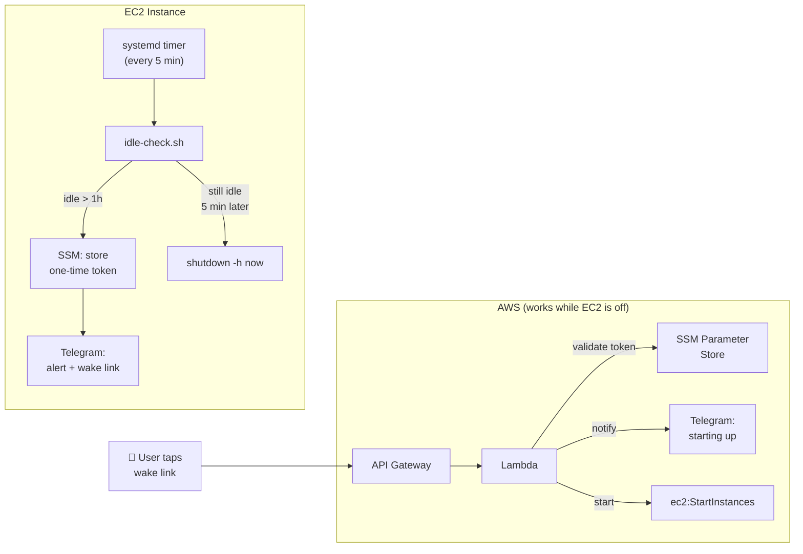

# BOOTSTRAP-IDLE-SHUTDOWN.md — Idle Shutdown for EC2 Agents

> **Purpose:** Automatically shut down the EC2 instance when the user has been idle for over 1 hour. Sends a Telegram warning with a **one-tap wake link** before shutdown. Fully independent of the OpenClaw gateway — runs via systemd timer.



---

## How It Works

1. A systemd timer fires every 5 minutes
2. It runs a bash script that reads the OpenClaw session JSONL files to find the last user message timestamp
3. If idle > 1 hour: generates a one-time wake token, stores it in SSM Parameter Store, and sends a Telegram alert with a clickable wake link
4. On the next run (5 min later), if still idle: `sudo shutdown -h now`
5. If the instance was recently booted (< 15 min), shutdown is skipped — prevents the wake-then-immediately-re-shutdown race condition
6. State is tracked in `memory/heartbeat-state.json` (`idleShutdownAlertSent` flag)

### Wake Link Flow

```
Idle script → generates UUID token → stores in SSM → sends Telegram with link
User taps link → API Gateway → Lambda → validates token → sends Telegram "starting up" → starts EC2
```

- The wake link is **one-time use** — token is deleted after first use
- If the instance is already running, the Lambda detects it and responds accordingly
- Expired/invalid tokens show a friendly error page

---

## Prerequisites

- EC2 instance with `sudo` access and an instance profile with `ssm:PutParameter` permission for `/openclaw/wake-token`
- OpenClaw installed and configured with Telegram channel
- Telegram bot token and your Telegram chat ID (numeric)
- Python 3 available (`/usr/bin/python3`)
- Deployment-time IAM permissions for creating Lambda, API Gateway, IAM roles, and SSM parameters

---

## Step 1 — Create the Python Helper

Save to `~/.openclaw/workspace/idle-check.py`:

```python
#!/usr/bin/env python3
"""Helper for idle-check scripts — timestamp parsing, idle detection, state management."""
import sys, json, os
from datetime import datetime, timezone

def parse_ts(ts):
    """Parse ISO 8601 timestamps with or without fractional seconds."""
    for fmt in ('%Y-%m-%dT%H:%M:%S.%fZ', '%Y-%m-%dT%H:%M:%SZ'):
        try:
            return datetime.strptime(ts, fmt).replace(tzinfo=timezone.utc)
        except ValueError:
            pass
    return None

def latest_user_ts(sessions_dir):
    """Find the most recent user message timestamp across all session JSONL files."""
    latest = None
    for fname in os.listdir(sessions_dir):
        if not fname.endswith('.jsonl') or '.checkpoint.' in fname:
            continue
        path = os.path.join(sessions_dir, fname)
        try:
            with open(path) as f:
                for line in f:
                    try:
                        obj = json.loads(line)
                        # Support both flat format (role at top level)
                        # and nested format (role inside message object)
                        role = obj.get('role') or (
                            obj.get('message', {}).get('role')
                            if isinstance(obj.get('message'), dict) else None
                        )
                        if role != 'user':
                            continue
                        ts = (obj.get('createdAt') or obj.get('timestamp')
                              or obj.get('ts'))
                        if ts and (latest is None or ts > latest):
                            latest = ts
                    except (json.JSONDecodeError, KeyError):
                        pass
        except OSError:
            pass
    return latest

def hours_idle(ts_str):
    """Calculate hours between a timestamp and now."""
    dt = parse_ts(ts_str)
    if dt is None:
        return None
    return (datetime.now(timezone.utc) - dt).total_seconds() / 3600

def get_state(state_file, key):
    """Read a key from the JSON state file."""
    try:
        with open(state_file) as f:
            return json.load(f).get(key, False)
    except (OSError, json.JSONDecodeError):
        return False

def set_state(state_file, key, value):
    """Write a key to the JSON state file."""
    try:
        with open(state_file) as f:
            data = json.load(f)
    except (OSError, json.JSONDecodeError):
        data = {}
    data[key] = value
    with open(state_file, 'w') as f:
        json.dump(data, f, indent=2)

def get_uptime_hours():
    """Get system uptime in hours from /proc/uptime."""
    try:
        with open('/proc/uptime') as f:
            return float(f.read().split()[0]) / 3600
    except (OSError, ValueError):
        return 999  # assume long uptime if unreadable

# --- CLI interface ---
if __name__ == '__main__':
    cmd = sys.argv[1]

    if cmd == '--latest-ts':
        sessions_dir = sys.argv[2]
        ts = latest_user_ts(sessions_dir)
        print(ts or '')

    elif cmd == '--hours-idle':
        h = hours_idle(sys.argv[2])
        if h is None:
            print('PARSE_ERROR')
            sys.exit(1)
        print(f'{h:.4f}')

    elif cmd == '--should-shutdown':
        idle_h = float(sys.argv[2])
        threshold_h = float(sys.argv[3])
        print('yes' if idle_h > threshold_h else 'no')

    elif cmd == '--uptime-hours':
        print(f'{get_uptime_hours():.4f}')

    elif cmd == '--get-state':
        print(str(get_state(sys.argv[2], sys.argv[3])).lower())

    elif cmd == '--set-state':
        val = sys.argv[4]
        parsed = True if val == 'true' else False if val == 'false' else val
        set_state(sys.argv[2], sys.argv[3], parsed)
```

---

## Step 2 — Deploy the Wake Lambda + API Gateway

The wake link is powered by a Lambda behind an HTTP API Gateway. The Lambda validates the one-time token, notifies you on Telegram, and starts the instance.

### 2.1 — Store Configuration in SSM

All configuration is stored in SSM Parameter Store — nothing is hardcoded in the Lambda or the idle script:

```bash
REGION="us-east-1"  # Set once, use everywhere
INSTANCE_ID="YOUR_INSTANCE_ID"
TELEGRAM_CHAT_ID="YOUR_NUMERIC_CHAT_ID"
TELEGRAM_BOT_TOKEN="YOUR_BOT_TOKEN"

aws ssm put-parameter --name "/openclaw/wake-config/instance-id" \
  --value "$INSTANCE_ID" --type String --overwrite --region "$REGION"

aws ssm put-parameter --name "/openclaw/wake-config/telegram-chat-id" \
  --value "$TELEGRAM_CHAT_ID" --type String --overwrite --region "$REGION"

aws ssm put-parameter --name "/openclaw/wake-config/telegram-bot-token" \
  --value "$TELEGRAM_BOT_TOKEN" --type SecureString --overwrite --region "$REGION"
```

### 2.2 — Create the Lambda IAM Role

```bash
ACCOUNT_ID="$(aws sts get-caller-identity --query Account --output text)"

aws iam create-role \
  --role-name loki-wake-lambda-role \
  --assume-role-policy-document '{
    "Version": "2012-10-17",
    "Statement": [{
      "Effect": "Allow",
      "Principal": {"Service": "lambda.amazonaws.com"},
      "Action": "sts:AssumeRole"
    }]
  }'

aws iam put-role-policy \
  --role-name loki-wake-lambda-role \
  --policy-name wake-permissions \
  --policy-document "{
    \"Version\": \"2012-10-17\",
    \"Statement\": [
      {
        \"Effect\": \"Allow\",
        \"Action\": [\"ec2:StartInstances\"],
        \"Resource\": \"arn:aws:ec2:${REGION}:${ACCOUNT_ID}:instance/${INSTANCE_ID}\"
      },
      {
        \"Effect\": \"Allow\",
        \"Action\": [\"ec2:DescribeInstanceStatus\"],
        \"Resource\": \"*\"
      },
      {
        \"Effect\": \"Allow\",
        \"Action\": [\"ssm:GetParameter\", \"ssm:DeleteParameter\"],
        \"Resource\": [
          \"arn:aws:ssm:${REGION}:${ACCOUNT_ID}:parameter/openclaw/wake-token\",
          \"arn:aws:ssm:${REGION}:${ACCOUNT_ID}:parameter/openclaw/wake-config/*\"
        ]
      },
      {
        \"Effect\": \"Allow\",
        \"Action\": [\"logs:CreateLogGroup\",\"logs:CreateLogStream\",\"logs:PutLogEvents\"],
        \"Resource\": \"arn:aws:logs:${REGION}:${ACCOUNT_ID}:*\"
      }
    ]
  }"

# Wait for IAM propagation
sleep 10
```

### 2.3 — Create the Lambda Function

Create a directory (e.g., `/tmp/wake-lambda/`) and save as `index.mjs`:

```javascript
import { SSMClient, GetParameterCommand, DeleteParameterCommand } from "@aws-sdk/client-ssm";
import { EC2Client, StartInstancesCommand, DescribeInstanceStatusCommand } from "@aws-sdk/client-ec2";

const ssm = new SSMClient({});
const ec2 = new EC2Client({});
const TOKEN_PARAM = "/openclaw/wake-token";
const CONFIG_PREFIX = "/openclaw/wake-config/";

async function getParam(name, decrypt = false) {
  const res = await ssm.send(new GetParameterCommand({ Name: name, WithDecryption: decrypt }));
  return res.Parameter.Value;
}

async function sendTelegram(botToken, chatId, text) {
  await fetch(`https://api.telegram.org/bot${botToken}/sendMessage`, {
    method: "POST",
    headers: { "Content-Type": "application/json" },
    body: JSON.stringify({ chat_id: chatId, text, disable_web_page_preview: true }),
  });
}

const html = (title, msg, emoji) => ({
  statusCode: 200,
  headers: { "content-type": "text/html; charset=utf-8" },
  body: `<!DOCTYPE html><html><head><meta name="viewport" content="width=device-width,initial-scale=1"><title>${title}</title>
  <style>body{font-family:-apple-system,system-ui,sans-serif;display:flex;justify-content:center;align-items:center;min-height:100vh;margin:0;background:#0D1117;color:#F0F6FC;text-align:center}
  .card{background:#161B22;border:1px solid #30363D;border-radius:12px;padding:2rem;max-width:400px}
  h1{font-size:3rem;margin:0}p{color:#8B949E;font-size:1.1rem}</style></head>
  <body><div class="card"><h1>${emoji}</h1><h2>${title}</h2><p>${msg}</p></div></body></html>`
});

export const handler = async (event) => {
  const token = event.queryStringParameters?.token;
  if (!token) return html("Missing Token", "No wake token provided.", "❌");

  // Validate token
  let stored;
  try {
    stored = await getParam(TOKEN_PARAM);
  } catch (e) {
    if (e.name === "ParameterNotFound") return html("Expired", "This wake link has already been used or expired.", "⏰");
    throw e;
  }
  if (token !== stored) return html("Invalid Token", "This wake link is not valid.", "🚫");

  // Token valid — consume it (one-time use)
  await ssm.send(new DeleteParameterCommand({ Name: TOKEN_PARAM }));

  // Load config from SSM
  const [instanceId, chatId, botToken] = await Promise.all([
    getParam(CONFIG_PREFIX + "instance-id"),
    getParam(CONFIG_PREFIX + "telegram-chat-id"),
    getParam(CONFIG_PREFIX + "telegram-bot-token", true),
  ]);

  // Check if already running
  try {
    const status = await ec2.send(new DescribeInstanceStatusCommand({
      InstanceIds: [instanceId], IncludeAllInstances: true
    }));
    const state = status.InstanceStatuses?.[0]?.InstanceState?.Name;
    if (state === "running") {
      await sendTelegram(botToken, chatId, "🐺 Already running — no action needed.");
      return html("Already Running", "Instance is already up and running!", "✅");
    }
  } catch (e) {
    // Describe failed — proceed with start attempt anyway
  }

  // Alert on Telegram first, then start
  await sendTelegram(botToken, chatId, "🐺 Starting up now — should be ready in about 60 seconds.");

  try {
    await ec2.send(new StartInstancesCommand({ InstanceIds: [instanceId] }));
  } catch (e) {
    if (!e.message?.includes("cannot be started")) throw e;
    // Already starting/running — that's fine
  }

  return html("Waking Up! 🐺", "Instance is starting. Give it about 60 seconds.", "🐺");
};
```

Deploy it:

```bash
cd /tmp/wake-lambda && zip -j /tmp/wake-lambda.zip index.mjs

aws lambda create-function \
  --function-name loki-wake \
  --runtime nodejs22.x \
  --handler index.handler \
  --role "arn:aws:iam::${ACCOUNT_ID}:role/loki-wake-lambda-role" \
  --zip-file fileb:///tmp/wake-lambda.zip \
  --timeout 10 \
  --memory-size 128 \
  --architectures arm64 \
  --region "$REGION"
```

### 2.4 — Create HTTP API Gateway

Lambda Function URLs may be blocked by Organization SCPs. HTTP API Gateway is the reliable alternative ($1/million requests — effectively free for this use case).

```bash
# Create HTTP API
API_ID=$(aws apigatewayv2 create-api \
  --name "loki-wake" \
  --protocol-type HTTP \
  --region "$REGION" \
  --query 'ApiId' --output text)

# Create Lambda integration
INTEGRATION_ID=$(aws apigatewayv2 create-integration \
  --api-id "$API_ID" \
  --integration-type AWS_PROXY \
  --integration-uri "arn:aws:lambda:${REGION}:${ACCOUNT_ID}:function:loki-wake" \
  --payload-format-version "2.0" \
  --region "$REGION" \
  --query 'IntegrationId' --output text)

# Create route
aws apigatewayv2 create-route \
  --api-id "$API_ID" \
  --route-key "GET /wake" \
  --target "integrations/$INTEGRATION_ID" \
  --region "$REGION"

# Create auto-deploy stage
aws apigatewayv2 create-stage \
  --api-id "$API_ID" \
  --stage-name '$default' \
  --auto-deploy \
  --region "$REGION"

# Grant API Gateway permission to invoke Lambda
aws lambda add-permission \
  --function-name loki-wake \
  --statement-id apigateway-invoke \
  --action lambda:InvokeFunction \
  --principal apigateway.amazonaws.com \
  --source-arn "arn:aws:execute-api:${REGION}:${ACCOUNT_ID}:${API_ID}/*" \
  --region "$REGION"

# Get the endpoint URL
WAKE_URL=$(aws apigatewayv2 get-api --api-id "$API_ID" --region "$REGION" --query 'ApiEndpoint' --output text)
echo "Wake URL: ${WAKE_URL}/wake"
```

Save the wake URL — you'll need it for the idle check script.

### 2.5 — Verify

```bash
# Should return "Missing Token" page
curl -s "${WAKE_URL}/wake" | grep -o '<h2>.*</h2>'

# Should return "Invalid Token" page
curl -s "${WAKE_URL}/wake?token=fake" | grep -o '<h2>.*</h2>'
```

---

## Step 3 — Create the Idle Check Script

Save to `~/.openclaw/workspace/loki-idle-check.sh`. **Replace `WAKE_LAMBDA_URL` with your API Gateway URL from Step 2.4.**

All Telegram credentials are fetched from SSM at runtime — nothing hardcoded in the script.

```bash
#!/bin/bash
# loki-idle-check.sh — Standalone idle monitor (systemd timer, every 5 min)
# Independent of OpenClaw gateway. Sends Telegram alert with one-time wake link.
set -euo pipefail

# --- Config (single source of truth) ---
REGION="us-east-1"
IDLE_THRESHOLD_HOURS=1.0
MIN_UPTIME_HOURS=0.25  # skip shutdown if booted < 15 min ago
LOG_MAX_LINES=500
SSM_TOKEN_PARAM="/openclaw/wake-token"
SSM_BOT_TOKEN_PARAM="/openclaw/wake-config/telegram-bot-token"
SSM_CHAT_ID_PARAM="/openclaw/wake-config/telegram-chat-id"
WAKE_LAMBDA_URL="YOUR_API_GATEWAY_URL/wake"

SCRIPT_DIR="$(dirname "$(readlink -f "$0")")"
STATE_FILE="$HOME/.openclaw/workspace/memory/heartbeat-state.json"
SESSIONS_DIR="$HOME/.openclaw/agents/main/sessions"
PY="$SCRIPT_DIR/idle-check.py"
LOG="/tmp/loki-idle-check.log"

# --- Helpers ---
log() { echo "$(date -u +%Y-%m-%dT%H:%M:%SZ) $*" >> "$LOG"; }

truncate_log() {
  if [[ -f "$LOG" ]] && (( $(wc -l < "$LOG") > LOG_MAX_LINES )); then
    tail -n "$LOG_MAX_LINES" "$LOG" > "${LOG}.tmp" && mv "${LOG}.tmp" "$LOG"
  fi
}

fetch_ssm() {
  local param="$1" decrypt="${2:-false}"
  local flags="--name $param --region $REGION --query Parameter.Value --output text"
  [[ "$decrypt" == "true" ]] && flags="$flags --with-decryption"
  aws ssm get-parameter $flags 2>/dev/null
}

send_telegram() {
  local token="$1" chat_id="$2" text="$3"
  curl -sf -X POST "https://api.telegram.org/bot${token}/sendMessage" \
    -H "Content-Type: application/json" \
    -d "{\"chat_id\":\"${chat_id}\",\"text\":\"${text}\",\"disable_web_page_preview\":true}" \
    >> "$LOG" 2>&1
}

# --- Main ---
truncate_log

# Find latest user message (proper JSON parsing, no fragile grep)
LATEST_TS=$(python3 "$PY" --latest-ts "$SESSIONS_DIR")

if [[ -z "$LATEST_TS" ]]; then
  log "ERROR: No user messages found in session logs."
  exit 1
fi

HOURS_IDLE=$(python3 "$PY" --hours-idle "$LATEST_TS")
if [[ "$HOURS_IDLE" == "PARSE_ERROR" ]]; then
  log "ERROR: Could not parse timestamp: $LATEST_TS"
  exit 1
fi

log "idle=${HOURS_IDLE}h last_msg=${LATEST_TS}"

SHOULD_SHUTDOWN=$(python3 "$PY" --should-shutdown "$HOURS_IDLE" "$IDLE_THRESHOLD_HOURS")

if [[ "$SHOULD_SHUTDOWN" != "yes" ]]; then
  # Active — reset alert flag
  python3 "$PY" --set-state "$STATE_FILE" idleShutdownAlertSent false
  exit 0
fi

# Guard: skip shutdown if instance just booted (prevents wake → immediate re-shutdown)
UPTIME_H=$(python3 "$PY" --uptime-hours)
if (( $(echo "$UPTIME_H < $MIN_UPTIME_HOURS" | bc -l) )); then
  log "SKIP: uptime=${UPTIME_H}h < ${MIN_UPTIME_HOURS}h minimum — recently booted"
  python3 "$PY" --set-state "$STATE_FILE" idleShutdownAlertSent false
  exit 0
fi

ALERT_SENT=$(python3 "$PY" --get-state "$STATE_FILE" idleShutdownAlertSent)

if [[ "$ALERT_SENT" == "false" ]]; then
  log "IDLE >${IDLE_THRESHOLD_HOURS}h — generating wake token"

  # Generate and store one-time wake token (fail-safe: abort if SSM write fails)
  WAKE_TOKEN=$(python3 -c "import uuid; print(uuid.uuid4())")
  if ! aws ssm put-parameter --name "$SSM_TOKEN_PARAM" --value "$WAKE_TOKEN" \
       --type String --overwrite --region "$REGION" > /dev/null 2>&1; then
    log "ERROR: Failed to store wake token in SSM — aborting alert"
    exit 1
  fi

  # Fetch Telegram credentials from SSM at runtime (never hardcoded)
  TG_TOKEN=$(fetch_ssm "$SSM_BOT_TOKEN_PARAM" true)
  TG_CHAT=$(fetch_ssm "$SSM_CHAT_ID_PARAM")

  if [[ -z "$TG_TOKEN" || -z "$TG_CHAT" ]]; then
    log "ERROR: Failed to fetch Telegram credentials from SSM"
    exit 1
  fi

  WAKE_LINK="${WAKE_LAMBDA_URL}?token=${WAKE_TOKEN}"
  send_telegram "$TG_TOKEN" "$TG_CHAT" \
    "🐺 Idle for over an hour. Shutting down in ~5 min to save costs.\n\n👉 Tap to wake me up: ${WAKE_LINK}"

  python3 "$PY" --set-state "$STATE_FILE" idleShutdownAlertSent true
  log "Alert sent with wake link. Will shutdown on next run."

else
  log "Alert already sent — SHUTTING DOWN NOW"
  sudo shutdown -h now
fi
```

---

## Step 4 — Create the Systemd Timer

```bash
sudo tee /etc/systemd/system/loki-idle-check.service << 'EOF'
[Unit]
Description=Loki idle check — shutdown if user is away for over 1 hour

[Service]
Type=oneshot
User=ec2-user
ExecStart=/bin/bash /home/ec2-user/.openclaw/workspace/loki-idle-check.sh
TimeoutSec=30
EOF

sudo tee /etc/systemd/system/loki-idle-check.timer << 'EOF'
[Unit]
Description=Loki idle check timer — every 5 minutes

[Timer]
OnBootSec=5min
OnUnitActiveSec=5min
AccuracySec=10s
Persistent=true

[Install]
WantedBy=timers.target
EOF

sudo systemctl daemon-reload
sudo systemctl enable --now loki-idle-check.timer
```

Verify:
```bash
sudo systemctl status loki-idle-check.timer
```

Test immediately:
```bash
sudo systemctl start loki-idle-check.service
cat /tmp/loki-idle-check.log
```

---

## Security

**Wake link security layers:**

1. **API Gateway URL** — random subdomain, not guessable or indexed
2. **One-time UUID token** — stored in SSM, deleted after first use. Expired tokens return a friendly error
3. **Lambda scoped permissions** — can only start one specific instance
4. **No hardcoded secrets** — all config (instance ID, Telegram credentials) stored in SSM Parameter Store and fetched at runtime by both the idle script and the Lambda

**Cost:** Effectively $0/month — Lambda free tier (1M requests) + HTTP API Gateway ($1/million requests) + SSM free tier.

> **Note on Lambda Function URLs:** These are simpler to set up but may be blocked by AWS Organizations SCPs (Service Control Policies). If you get `Forbidden` errors with Function URLs, use HTTP API Gateway instead — that's what this bootstrap uses.

---

## State File

`~/.openclaw/workspace/memory/heartbeat-state.json`:
```json
{
  "idleShutdownAlertSent": false
}
```

---

## Log File

`/tmp/loki-idle-check.log` — auto-truncated to 500 lines on each run:
```
2026-04-05T08:06:23Z idle=0.0077h last_msg=2026-04-05T08:05:55.617Z
2026-04-05T09:10:01Z IDLE >1h — generating wake token
2026-04-05T09:10:02Z Alert sent with wake link. Will shutdown on next run.
2026-04-05T09:15:01Z SKIP: uptime=0.0833h < 0.25h minimum — recently booted
```

---

## Notes

- The timer is **completely independent of OpenClaw** — if the gateway crashes, idle shutdown still works
- Telegram credentials are fetched from **SSM at runtime** — never hardcoded in scripts
- The **uptime guard** (default 15 min) prevents the wake → immediate re-shutdown race condition
- The two-step shutdown (alert → wait 5min → shutdown) gives the user time to come back or tap the wake link
- Session JSONL parsing handles both flat (`"role":"user"`) and nested (`"message":{"role":"user"}`) formats, and skips checkpoint files
- The wake link works even after shutdown — it starts the instance directly via EC2 API
- Log file is auto-truncated to prevent unbounded growth
