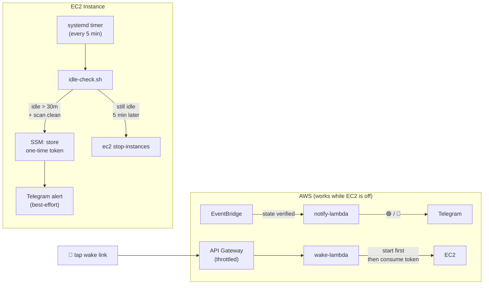

# Idle Shutdown & Wake

Automatically shut down the EC2 instance after 30 minutes of user inactivity. Sends a Telegram alert with a **one-tap wake link** before shutdown. EventBridge notifies you when the instance starts or stops.

## What's in this folder

```
idle-shutdown/
├── idle-check.py           # Python helper — idle detection, timestamp parsing, state management
├── idle-check.sh           # Bash orchestrator — run by systemd timer every 5 min
├── wake-lambda/
│   └── index.mjs           # Wake Lambda — validates token, starts instance
├── notify-lambda/
│   └── handler.py          # EventBridge Lambda — Telegram notifications on start/stop
├── systemd/
│   ├── idle-check.service  # systemd oneshot service
│   └── idle-check.timer    # 5-minute timer
└── README.md               # You are here
```

## Architecture



## How it works

1. **Systemd timer** fires every 5 minutes
2. **idle-check.sh** calls **idle-check.py** to scan OpenClaw session JSONL files for the last real user message
3. Only messages with Telegram `sender_id` metadata count — heartbeats, system messages, and memory flushes are excluded
4. If idle > 30 min and the scan is clean (no file errors, no parse failures): generates a one-time UUID token → stores in SSM → sends Telegram alert → waits one more cycle → shuts down
5. **Wake Lambda** validates the token, starts the instance, *then* deletes the token. If start fails, token is preserved.
6. **EventBridge** fires on start/stop → notify Lambda sends Telegram with IP (on start) or wake link (on stop)

## Where to put the files

### On the EC2 instance

| File | Destination |
|------|-------------|
| `idle-check.py` | `~/.openclaw/workspace/idle-check.py` |
| `idle-check.sh` | `~/.openclaw/workspace/idle-check.sh` |
| `systemd/idle-check.service` | `/etc/systemd/system/idle-check.service` |
| `systemd/idle-check.timer` | `/etc/systemd/system/idle-check.timer` |

```bash
chmod +x ~/.openclaw/workspace/idle-check.py ~/.openclaw/workspace/idle-check.sh
sudo cp systemd/idle-check.service systemd/idle-check.timer /etc/systemd/system/
sudo systemctl daemon-reload
sudo systemctl enable --now idle-check.timer
```

### On AWS (serverless)

| File | Deploy as |
|------|-----------|
| `wake-lambda/index.mjs` | Lambda function (Node.js 22, arm64) behind HTTP API Gateway |
| `notify-lambda/handler.py` | Lambda function (Python 3.13, arm64) triggered by EventBridge |

## Setup

### 1. Store config in SSM

```bash
REGION="us-east-1"

aws ssm put-parameter --name "/openclaw/wake-config/instance-id" \
  --value "<your-instance-id>" --type String --overwrite --region "$REGION"

aws ssm put-parameter --name "/openclaw/wake-config/telegram-chat-id" \
  --value "<your-chat-id>" --type String --overwrite --region "$REGION"

aws ssm put-parameter --name "/openclaw/wake-config/telegram-bot-token" \
  --value "<your-bot-token>" --type SecureString --overwrite --region "$REGION"
```

### 2. Deploy Wake Lambda

```bash
ACCOUNT_ID="$(aws sts get-caller-identity --query Account --output text)"

# Create IAM role
aws iam create-role --role-name wake-lambda-role \
  --assume-role-policy-document '{
    "Version":"2012-10-17",
    "Statement":[{"Effect":"Allow","Principal":{"Service":"lambda.amazonaws.com"},"Action":"sts:AssumeRole"}]
  }'

aws iam put-role-policy --role-name wake-lambda-role --policy-name wake-permissions \
  --policy-document "{
    \"Version\":\"2012-10-17\",
    \"Statement\":[
      {\"Effect\":\"Allow\",\"Action\":\"ec2:StartInstances\",\"Resource\":\"arn:aws:ec2:${REGION}:${ACCOUNT_ID}:instance/<your-instance-id>\"},
      {\"Effect\":\"Allow\",\"Action\":\"ec2:DescribeInstanceStatus\",\"Resource\":\"*\"},
      {\"Effect\":\"Allow\",\"Action\":[\"ssm:GetParameter\",\"ssm:DeleteParameter\"],\"Resource\":[\"arn:aws:ssm:${REGION}:${ACCOUNT_ID}:parameter/openclaw/wake-token\",\"arn:aws:ssm:${REGION}:${ACCOUNT_ID}:parameter/openclaw/wake-config/*\"]},
      {\"Effect\":\"Allow\",\"Action\":[\"logs:CreateLogGroup\",\"logs:CreateLogStream\",\"logs:PutLogEvents\"],\"Resource\":\"arn:aws:logs:${REGION}:${ACCOUNT_ID}:*\"}
    ]
  }"

sleep 10

# Deploy Lambda
zip -j /tmp/wake-lambda.zip wake-lambda/index.mjs
aws lambda create-function --function-name agent-wake \
  --runtime nodejs22.x --handler index.handler \
  --role "arn:aws:iam::${ACCOUNT_ID}:role/wake-lambda-role" \
  --zip-file fileb:///tmp/wake-lambda.zip \
  --timeout 10 --memory-size 128 --architectures arm64 --region "$REGION"
```

### 3. Create API Gateway

```bash
API_ID=$(aws apigatewayv2 create-api --name agent-wake --protocol-type HTTP \
  --region "$REGION" --query ApiId --output text)

INTEG_ID=$(aws apigatewayv2 create-integration --api-id "$API_ID" \
  --integration-type AWS_PROXY \
  --integration-uri "arn:aws:lambda:${REGION}:${ACCOUNT_ID}:function:agent-wake" \
  --payload-format-version 2.0 --region "$REGION" --query IntegrationId --output text)

aws apigatewayv2 create-route --api-id "$API_ID" --route-key "GET /wake" \
  --target "integrations/$INTEG_ID" --region "$REGION"

aws apigatewayv2 create-stage --api-id "$API_ID" --stage-name '$default' \
  --auto-deploy --region "$REGION"

aws apigatewayv2 update-stage --api-id "$API_ID" --stage-name '$default' \
  --route-settings '{"GET /wake":{"ThrottlingBurstLimit":5,"ThrottlingRateLimit":1}}'

aws lambda add-permission --function-name agent-wake \
  --statement-id apigw --action lambda:InvokeFunction \
  --principal apigateway.amazonaws.com \
  --source-arn "arn:aws:execute-api:${REGION}:${ACCOUNT_ID}:${API_ID}/*" --region "$REGION"

WAKE_URL="$(aws apigatewayv2 get-api --api-id "$API_ID" --region "$REGION" \
  --query ApiEndpoint --output text)/wake"

# Store for idle-check.sh
aws ssm put-parameter --name "/openclaw/wake-config/wake-url" \
  --value "$WAKE_URL" --type String --overwrite --region "$REGION"

echo "Wake URL: $WAKE_URL"
```

### 4. Deploy Notify Lambda

```bash
aws iam create-role --role-name ec2-notify-lambda-role \
  --assume-role-policy-document '{
    "Version":"2012-10-17",
    "Statement":[{"Effect":"Allow","Principal":{"Service":"lambda.amazonaws.com"},"Action":"sts:AssumeRole"}]
  }'

aws iam put-role-policy --role-name ec2-notify-lambda-role --policy-name notify-permissions \
  --policy-document "{
    \"Version\":\"2012-10-17\",
    \"Statement\":[
      {\"Effect\":\"Allow\",\"Action\":[\"logs:CreateLogGroup\",\"logs:CreateLogStream\",\"logs:PutLogEvents\"],\"Resource\":\"arn:aws:logs:${REGION}:${ACCOUNT_ID}:*\"},
      {\"Effect\":\"Allow\",\"Action\":\"ec2:DescribeInstances\",\"Resource\":\"*\"},
      {\"Effect\":\"Allow\",\"Action\":[\"ssm:GetParameter\",\"ssm:PutParameter\"],\"Resource\":[\"arn:aws:ssm:${REGION}:${ACCOUNT_ID}:parameter/openclaw/wake-config/*\",\"arn:aws:ssm:${REGION}:${ACCOUNT_ID}:parameter/openclaw/wake-token\"]}
    ]
  }"

sleep 10

zip -j /tmp/notify-lambda.zip notify-lambda/handler.py
aws lambda create-function --function-name ec2-notify \
  --runtime python3.13 --handler handler.handler \
  --role "arn:aws:iam::${ACCOUNT_ID}:role/ec2-notify-lambda-role" \
  --zip-file fileb:///tmp/notify-lambda.zip \
  --timeout 30 --memory-size 128 --architectures arm64 \
  --environment "Variables={INSTANCE_ID=<your-instance-id>,TELEGRAM_CHAT_ID=<your-chat-id>,WAKE_URL=$WAKE_URL}" \
  --region "$REGION"
```

### 5. Create EventBridge Rule

```bash
aws events put-rule --name ec2-state-notify \
  --event-pattern "{
    \"source\":[\"aws.ec2\"],
    \"detail-type\":[\"EC2 Instance State-change Notification\"],
    \"detail\":{\"state\":[\"running\",\"stopped\"],\"instance-id\":[\"<your-instance-id>\"]}
  }" --region "$REGION"

NOTIFY_ARN=$(aws lambda get-function --function-name ec2-notify \
  --query Configuration.FunctionArn --output text --region "$REGION")

aws events put-targets --rule ec2-state-notify \
  --targets "Id=notify,Arn=$NOTIFY_ARN" --region "$REGION"

aws lambda add-permission --function-name ec2-notify \
  --statement-id eventbridge --action lambda:InvokeFunction \
  --principal events.amazonaws.com \
  --source-arn "arn:aws:events:${REGION}:${ACCOUNT_ID}:rule/ec2-state-notify" --region "$REGION"
```

### 6. Install on instance

```bash
sudo systemctl daemon-reload
sudo systemctl enable --now idle-check.timer
sudo systemctl status idle-check.timer
```

## Verify

```bash
# Dry run
./idle-check.sh --dry-run
tail -3 /tmp/idle-check.log

# Wake rejects bad tokens
curl -s "$WAKE_URL?token=fake"

# Scan error handling
python3 idle-check.py --idle-hours /nonexistent
```

## Safety model

| Protection | How |
|-----------|-----|
| **Fail-closed scans** | Unreadable files or unparseable timestamps → shutdown blocked |
| **Start before consume** | Wake Lambda starts instance first, deletes token only after success |
| **Telegram is optional** | Broken Telegram config never blocks wake or shutdown |
| **Stale event guard** | Notify Lambda checks actual EC2 state before rotating token |
| **Event dedup** | Duplicate `stopped` events don't overwrite valid wake links |
| **flock** | Prevents overlapping timer runs |
| **Min uptime guard** | 15 min — prevents wake → immediate re-shutdown |
| **API throttling** | 1 req/sec, burst 5 on API Gateway |
| **No hardcoded secrets** | Everything in SSM Parameter Store |
| **No shell injection** | Telegram sends via env vars, not string interpolation |

## Cost

~$0/month — Lambda free tier + HTTP API Gateway ($1/million requests) + SSM free tier.
